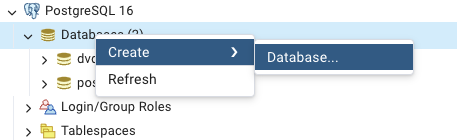
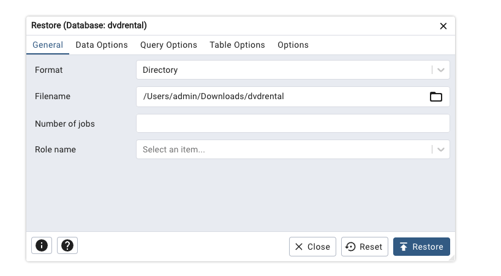

# Learning SQL with PostgresSQL

## Install Postgress

https://www.postgresql.org/download/

## Import Database into pgAdmin 4

Give it any name and press create.

On the left side pannel, right click on the newly created db name and press restore.

If it fails, check online for help, else continue to the begginners path
