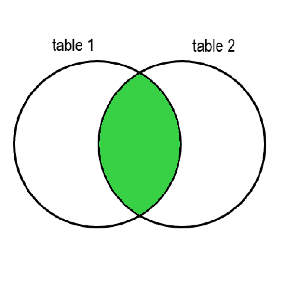
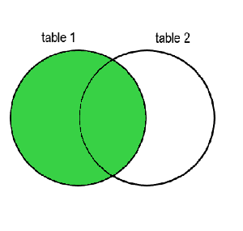
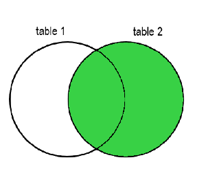
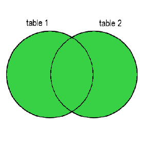

# **Beginner Level SQL Course Using PostgreSQL**

## **Introduction**

Welcome to the beginner's SQL course! This course is designed to teach you the fundamentals of SQL (Structured Query Language) using PostgreSQL, one of the most popular open-source relational database management systems. We will use a practical approach by working with a real database schema, which represents a video rental store.

By the end of this course, you will be able to:

- Understand basic SQL concepts and syntax.
- Write SQL queries to retrieve, filter, and sort data.
- Use aggregate functions and group data.
- Join tables to retrieve related data from multiple tables.
- Modify data using INSERT, UPDATE, and DELETE statements.

Let's get started!

---

## **Database Schema Overview**

Before diving into SQL, let's familiarize ourselves with the database schema we'll be using throughout this course. The database models a video rental store with the following tables:

- **actor**: Information about actors.
- **address**: Addresses for customers and staff.
- **category**: Categories of films.
- **city**: Cities where addresses are located.
- **country**: Countries where cities are located.
- **customer**: Customer information.
- **film**: Information about films.
- **film_actor**: Relationship between films and actors.
- **film_category**: Relationship between films and categories.
- **inventory**: Inventory of films in stores.
- **language**: Languages of films.
- **payment**: Payment transactions.
- **rental**: Rental transactions.
- **staff**: Staff information.
- **store**: Store information.

We'll explore these tables in more detail as we progress.

---

# **Lesson 1: Introduction to SQL and SELECT Statements**

## **What is SQL?**

SQL (Structured Query Language) is a standard language for accessing and manipulating relational databases. It allows you to perform tasks such as querying data, updating records, and managing database objects.

## **Basic SELECT Statement Syntax**

The `SELECT` statement is used to retrieve data from one or more tables. The basic syntax is:

```sql
SELECT column1, column2, ...
FROM table_name;
```

- `SELECT`: Specifies the columns to retrieve.
- `FROM`: Specifies the table to query.

## **Selecting All Columns from a Table**

To select all columns from a table, use the asterisk (`*`):

```sql
SELECT * FROM table_name;
```

**Example:**

Retrieve all columns from the `actor` table:

```sql
SELECT * FROM actor;
```

## **Selecting Specific Columns**

You can specify which columns to retrieve by listing them after the `SELECT` keyword.

**Example:**

Retrieve the `first_name` and `last_name` columns from the `actor` table:

```sql
SELECT first_name, last_name FROM actor;
```

---

## **Exercise 1**

### **Objective:**

Practice basic `SELECT` statements to retrieve data from tables.

### **Tasks:**

1. Retrieve all columns from the `film` table.
2. Retrieve the `title` and `description` columns from the `film` table.
3. Retrieve all columns from the `customer` table.
4. Retrieve the `first_name`, `last_name`, and `email` columns from the `customer` table.

### **Solutions:**

<details>
  <summary>Click here to view solutions</summary>

1. ```sql
   SELECT * FROM film;
   ```

2. ```sql
   SELECT title, description FROM film;
   ```

3. ```sql
   SELECT * FROM customer;
   ```

4. ```sql
   SELECT first_name, last_name, email FROM customer;
   ```

</details>

---

# **Lesson 2: Filtering Data with WHERE Clause**

## **Using WHERE Clause to Filter Data**

The `WHERE` clause is used to filter records that meet certain conditions.

**Syntax:**

```sql
SELECT column1, column2, ...
FROM table_name
WHERE condition;
```

## **Operators**

- Equal to: `=`
- Not equal to: `<>` or `!=`
- Greater than: `>`
- Less than: `<`
- Greater than or equal to: `>=`
- Less than or equal to: `<=`

**Example:**

Retrieve all films released in the year 2006:

```sql
SELECT * FROM film
WHERE release_year = 2006;
```

## **Logical Operators**

- **AND**: Combines two conditions; both must be true.
- **OR**: At least one of the conditions must be true.
- **NOT**: Negates a condition.

**Example:**

Retrieve films with a rating of 'PG' released in 2006:

```sql
SELECT * FROM film
WHERE rating = 'PG' AND release_year = 2006;
```

## **Using BETWEEN, IN, LIKE**

### **BETWEEN**

Select values within a range.

**Example:**

Retrieve films with `film_id` between 10 and 20:

```sql
SELECT * FROM film
WHERE film_id BETWEEN 10 AND 20;
```

### **IN**

Select values that match any value in a list.

**Example:**

Retrieve customers from stores 1 or 2:

```sql
SELECT * FROM customer
WHERE store_id IN (1, 2);
```

### **LIKE**

Search for a pattern in a column.

- `%` represents zero or more characters.
- `_` represents a single character.

**Example:**

Retrieve customers whose last name starts with 'S':

```sql
SELECT * FROM customer
WHERE last_name LIKE 'S%';
```

---

## **Exercise 2**

### **Objective:**

Practice using the `WHERE` clause and various operators to filter data.

### **Tasks:**

1. Retrieve all films with a rating of 'R'.
2. Retrieve customers whose first name starts with 'A'.
3. Retrieve films released between 2005 and 2007.
4. Retrieve actors whose last name ends with 'son'.
5. Retrieve payments where the amount is greater than 5.00.
6. Retrieve actors whose first name is exactly 5 characters long, starts with J and ends with e.

### **Solutions:**

<details>
  <summary>Click here to view solutions</summary>

1. **Retrieve all films with a rating of 'R':**

   ```sql
   SELECT * FROM film
   WHERE rating = 'R';
   ```

2. **Retrieve customers whose first name starts with 'A':**

   ```sql
   SELECT * FROM customer
   WHERE first_name LIKE 'A%';
   ```

3. **Retrieve films released between 2005 and 2007:**

   ```sql
   SELECT * FROM film
   WHERE release_year BETWEEN 2005 AND 2007;
   ```

4. **Retrieve actors whose last name ends with 'son':**

   ```sql
   SELECT * FROM actor
   WHERE last_name LIKE '%son';
   ```

5. **Retrieve payments where the amount is greater than 5.00:**

   ```sql
   SELECT * FROM payment
   WHERE amount > 5.00;
   ```

6. **Retrieve actors whose first name is exactly 5 characters long, starts with J and ends with e:**

   ```sql
   SELECT * FROM actor WHERE first_name LIKE 'J___e';
   ```

</details>

---

# **Lesson 3: Sorting Data with ORDER BY**

## **Using ORDER BY to Sort Results**

The `ORDER BY` clause is used to sort the result set by one or more columns.

**Syntax:**

```sql
SELECT column1, column2, ...
FROM table_name
ORDER BY column1 [ASC|DESC], column2 [ASC|DESC], ...;
```

- `ASC`: Ascending order (default).
- `DESC`: Descending order.

**Example:**

Retrieve all films sorted by title in ascending order:

```sql
SELECT * FROM film
ORDER BY title ASC;
```

## **Sorting by Multiple Columns**

You can sort by multiple columns by listing them separated by commas.

**Example:**

Retrieve all customers sorted by `last_name` ascending and `first_name` descending:

```sql
SELECT * FROM customer
ORDER BY last_name ASC, first_name DESC;
```

---

## **Exercise 3**

### **Objective:**

Practice sorting data using `ORDER BY`.

### **Tasks:**

1. Retrieve all actors sorted by `last_name` in descending order.
2. Retrieve all films sorted by `rental_rate` descending and `title` ascending.
3. Retrieve all payments sorted by `payment_date` ascending.

### **Solutions:**

<details>
  <summary>Click here to view solutions</summary>

1. ```sql
   SELECT * FROM actor
   ORDER BY last_name DESC;
   ```

2. ```sql
   SELECT * FROM film
   ORDER BY rental_rate DESC, title ASC;
   ```

3. ```sql
   SELECT * FROM payment
   ORDER BY payment_date ASC;
   ```

</details>

---

# **Lesson 4: Aggregate Functions and GROUP BY**

## **Aggregate Functions**

Aggregate functions perform calculations on a set of values and return a **single value**.

- **COUNT**: Returns the number of rows.
- **SUM**: Returns the sum of values.
- **AVG**: Returns the average value.
- **MIN**: Returns the minimum value.
- **MAX**: Returns the maximum value.

_Note:_ if you want to check what other functions are available [click here](https://www.postgresql.org/docs/9.5/functions-aggregate.html)

**Example:**

Count the total number of films:

```sql
SELECT COUNT(*) FROM film;
```

Calculate the average rental rate:

```sql
SELECT AVG(rental_rate) FROM film;
```

## **Using GROUP BY to Group Data**

The `GROUP BY` clause groups rows that have the same values in specified columns into summary rows.

**Syntax:**

```sql
SELECT column1, aggregate_function(column2)
FROM table_name
GROUP BY column1;
```

**Example:**

Count the number of films for each rating:

```sql
SELECT rating, COUNT(*) AS film_count
FROM film
GROUP BY rating;
```

## **Filtering Groups with HAVING Clause**

The `HAVING` clause is used to filter groups based on aggregate functions.

**Example:**

Retrieve ratings with more than 200 films:

```sql
SELECT rating, COUNT(*) AS film_count
FROM film
GROUP BY rating
HAVING COUNT(*) > 200;
```

---

## **Exercise 4**

### **Objective:**

Practice using aggregate functions and grouping data.

### **Tasks:**

1. Count the total number of customers.
2. Find the minimum, maximum, and average `rental_rate` from the `film` table.
3. List the number of films in each `language_id`.
4. Find the total amount of payments made on '2007-02-17'.
5. List each film rating and the average length of films for each rating.
6. Find all customers who have made more than 30 rental transactions
7. Identify staff members who have processed an average payment amount greater than $4.00, but only consider payments made before '2007-02-15'. Display the staff_id and their AVG payment amount.

### **Solutions:**

<details>
  <summary>Click here to view solutions</summary>

1. **Count the total number of customers:**

   ```sql
   SELECT COUNT(*) FROM customer;
   ```

2. **Find the minimum, maximum, and average `rental_rate` from the `film` table:**

   ```sql
   SELECT MIN(rental_rate) AS min_rate,
          MAX(rental_rate) AS max_rate,
          AVG(rental_rate) AS avg_rate
   FROM film;
   ```

3. **List the number of films in each `language_id`:**

   ```sql
   SELECT language_id, COUNT(*) AS film_count
   FROM film
   GROUP BY language_id;
   ```

4. **Find the total amount of payments made on '2005-05-25':**

   ```sql
   SELECT SUM(amount) AS total_payments
   FROM payment
   WHERE DATE(payment_date) = '2007-02-17';
   ```

5. **List each film rating and the average length of films for each rating:**

   ```sql
   SELECT rating, AVG(length) AS average_length
   FROM film
   GROUP BY rating;
   ```

6. **Find all customers who have made more than 30 rental transactions:**

   ```sql
   SELECT customer_id, COUNT(rental_id) AS total_rentals
   FROM rental
   GROUP BY customer_id
   HAVING COUNT(rental_id) > 30;
   ```

7. **Identify staff members who have processed an average payment amount greater than $4.00, but only consider payments made before '2007-02-17'. Display the staff_id and their AVG payment amount:**

   ```sql
   SELECT AVG(amount) as avg_amount, staff_id
   FROM payment
   WHERE DATE(payment_date) < '2007-02-17'
   GROUP BY staff_id
   HAVING AVG(amount) > 4;
   ```

   </details>

---

# **Lesson 5: Joining Tables**

## **Introduction to JOINs**

JOINs are used to combine rows from two or more tables based on related columns.

## **Tables Overview**

### **Table 1: `customer`**

| customer_id | first_name | last_name |
| ----------- | ---------- | --------- |
| 1           | John       | Doe       |
| 2           | Jane       | Smith     |
| 3           | Bob        | Johnson   |

### **Table 2: `rental`**

| rental_id | rental_date | customer_id |
| --------- | ----------- | ----------- |
| 101       | 2021-01-01  | 1           |
| 102       | 2021-01-02  | 2           |
| 103       | 2021-01-03  | 4           |

_Note:_ Customer with `customer_id` 4 does not exist in the `customer` table.

### **Table 3: `payment`**

| payment_id | amount | customer_id |
| ---------- | ------ | ----------- |
| 201        | 5.99   | 1           |
| 202        | 2.99   | 2           |
| 203        | 3.99   | 5           |

_Note:_ Customer with `customer_id` 5 does not exist in the `customer` table.

---

# **1. INNER JOIN**



### **Definition**

An **INNER JOIN** returns records that have matching values in both tables.

### **SQL Example**

```sql
SELECT c.customer_id, c.first_name, r.rental_id, r.rental_date
FROM customer c
INNER JOIN rental r ON c.customer_id = r.customer_id;
```

### **Explanation**

- The query joins `customer` and `rental` on `customer_id`.
- Only records where `customer_id` exists in both tables are returned.

### **Expected Output**

| customer_id | first_name | rental_id | rental_date |
| ----------- | ---------- | --------- | ----------- |
| 1           | John       | 101       | 2021-01-01  |
| 2           | Jane       | 102       | 2021-01-02  |

_Note:_ Rental with `customer_id` 4 is excluded because there is no matching customer.

### **INNER JOIN with Three Tables**

**SQL Example**

```sql
SELECT c.customer_id, c.first_name, p.payment_id, p.amount
FROM customer c
INNER JOIN payment p ON c.customer_id = p.customer_id;
```

**Explanation**

- Returns customers who have made payments.

### **Expected Output**

| customer_id | first_name | payment_id | amount |
| ----------- | ---------- | ---------- | ------ |
| 1           | John       | 201        | 5.99   |
| 2           | Jane       | 202        | 2.99   |

_Note:_ Payment with `customer_id` 5 is excluded.

---

# **2. LEFT JOIN (LEFT OUTER JOIN)**



### **Definition**

A **LEFT JOIN** returns all records from the left table (`customer`), and the matched records from the right table (`rental`). If there is no match, `NULL` values are returned for columns from the right table.

### **SQL Example**

```sql
SELECT c.customer_id, c.first_name, r.rental_id, r.rental_date
FROM customer c
LEFT JOIN rental r ON c.customer_id = r.customer_id;
```

### **Explanation**

- Retrieves all customers.
- Includes rental information if available; otherwise, `NULL`.

### **Expected Output**

| customer_id | first_name | rental_id | rental_date |
| ----------- | ---------- | --------- | ----------- |
| 1           | John       | 101       | 2021-01-01  |
| 2           | Jane       | 102       | 2021-01-02  |
| 3           | Bob        | NULL      | NULL        |

_Note:_ Bob has no rentals, so rental columns are `NULL`.

### **LEFT JOIN with Three Tables**

**SQL Example**

```sql
SELECT c.customer_id, c.first_name, p.payment_id, p.amount
FROM customer c
LEFT JOIN payment p ON c.customer_id = p.customer_id;
```

**Expected Output**

| customer_id | first_name | payment_id | amount |
| ----------- | ---------- | ---------- | ------ |
| 1           | John       | 201        | 5.99   |
| 2           | Jane       | 202        | 2.99   |
| 3           | Bob        | NULL       | NULL   |

_Note:_ Bob has not made any payments.

---

# **3. RIGHT JOIN (RIGHT OUTER JOIN)**



### **Definition**

A **RIGHT JOIN** returns all records from the right table (`rental`), and the matched records from the left table (`customer`). If there is no match, `NULL` values are returned for columns from the left table.

### **SQL Example**

```sql
SELECT c.customer_id, c.first_name, r.rental_id, r.rental_date
FROM customer c
RIGHT JOIN rental r ON c.customer_id = r.customer_id;
```

### **Explanation**

- Retrieves all rentals.
- Includes customer information if available; otherwise, `NULL`.

### **Expected Output**

| customer_id | first_name | rental_id | rental_date |
| ----------- | ---------- | --------- | ----------- |
| 1           | John       | 101       | 2021-01-01  |
| 2           | Jane       | 102       | 2021-01-02  |
| NULL        | NULL       | 103       | 2021-01-03  |

_Note:_ Rental with `customer_id` 4 has no matching customer, so customer columns are `NULL`.

---

# **4. FULL OUTER JOIN**



### **Definition**

A **FULL OUTER JOIN** returns all records when there is a match in either left or right table.

### **SQL Example**

```sql
SELECT c.customer_id, c.first_name, r.rental_id, r.rental_date
FROM customer c
FULL OUTER JOIN rental r ON c.customer_id = r.customer_id;
```

### **Explanation**

- Combines results of both LEFT and RIGHT JOIN.
- Includes all records from both tables.

### **Expected Output**

| customer_id | first_name | rental_id | rental_date |
| ----------- | ---------- | --------- | ----------- |
| 1           | John       | 101       | 2021-01-01  |
| 2           | Jane       | 102       | 2021-01-02  |
| 3           | Bob        | NULL      | NULL        |
| NULL        | NULL       | 103       | 2021-01-03  |

_Note:_ Both unmatched customers and rentals are included with `NULL` where there's no match.

---

# **5. CROSS JOIN**

### **Definition**

A **CROSS JOIN** returns the Cartesian product of the two tables, combining every row from the first table with every row from the second table.

### **SQL Example**

```sql
SELECT c.customer_id, c.first_name, r.rental_id, r.rental_date
FROM customer c
CROSS JOIN rental r;
```

### **Explanation**

- Each customer is paired with every rental.

### **Expected Output**

| customer_id | first_name | rental_id | rental_date |
| ----------- | ---------- | --------- | ----------- |
| 1           | John       | 101       | 2021-01-01  |
| 1           | John       | 102       | 2021-01-02  |
| 1           | John       | 103       | 2021-01-03  |
| 2           | Jane       | 101       | 2021-01-01  |
| 2           | Jane       | 102       | 2021-01-02  |
| 2           | Jane       | 103       | 2021-01-03  |
| 3           | Bob        | 101       | 2021-01-01  |
| 3           | Bob        | 102       | 2021-01-02  |
| 3           | Bob        | 103       | 2021-01-03  |

_Note:_ Total rows = number of customers × number of rentals (3×3=9).

## **Combining JOINs**

You can combine different JOINs to retrieve complex datasets.

**Example:** Find all customers along with their rentals and payments.

**SQL Example**

```sql
SELECT c.customer_id, c.first_name, r.rental_id, p.payment_id, p.amount
FROM customer c
LEFT JOIN rental r ON c.customer_id = r.customer_id
LEFT JOIN payment p ON c.customer_id = p.customer_id;
```

---

# **Understanding JOIN Behavior**

## **INNER JOIN**

- **Use Case:** When you need only the records that have matches in both tables.
- **Result:** Excludes records without matches.

## **LEFT JOIN**

- **Use Case:** When you need all records from the left table, regardless of matches in the right table.
- **Result:** Includes all left table records; right table columns are `NULL` when no match.

## **RIGHT JOIN**

- **Use Case:** When you need all records from the right table, regardless of matches in the left table.
- **Result:** Includes all right table records; left table columns are `NULL` when no match.

## **FULL OUTER JOIN**

- **Use Case:** When you need all records from both tables.
- **Result:** Combines LEFT and RIGHT JOIN results; `NULL` where there's no match.

## **CROSS JOIN**

- **Use Case:** When you need every combination of records from both tables.
- **Result:** Number of rows equals the product of the number of rows in both tables.

---

# **Practical Considerations**

- **Performance:** Be cautious with JOINs on large tables, especially CROSS JOINs, as they can be resource-intensive.
- **NULL Handling:** Remember that `NULL` values may require special handling in your queries (e.g., using `COALESCE` to provide default values).
- **JOIN Conditions:** Always ensure your JOIN conditions are correct to avoid unintended results.

### **4. FULL OUTER JOIN Example**

**Query:**

```sql
SELECT c.customer_id, c.first_name, r.rental_id
FROM customer c
FULL OUTER JOIN rental r ON c.customer_id = r.customer_id;
```

**Result:**

- All customers and rentals are included.
- `NULL` values where there's no match.

---

# **Conclusion**

By using these examples, you can see how different JOINs affect the result set of your queries. Experimenting with sample data helps in understanding the practical implications of each JOIN type.

Feel free to run these queries against your database to see the actual results, and don't hesitate to ask if you have further questions!

## **Exercise 5**

### **Objective:**

Practice joining tables to retrieve related data.

### **Tasks:**

1. Retrieve the first and last names of all customers along with the address they live at.
2. List the titles of all films along with their corresponding language names.
3. For each film, list the title, category name, and language name.
4. List all customers and the total amount they have paid. Include customers who have not made any payments.
5. List all payments and the first and last names of the staff members who processed them. Include payments that do not have an associated staff member (if any).
6. Retrieve a list of all actors and the films they have acted in. Include actors who have not acted in any films and films that do not have any actors (if any).
7. Find all pairs of customers who live in the same city. List the customer IDs and names.
8. Generate a list of all possible combinations of film titles and category names.
9. For each rental, list the rental ID, rental date, customer name, film title, and staff name who processed the rental.
10. List the top 5 films that have generated the highest total revenue. Include the film title and total revenue.

### **Solutions:**

#### **Exercise 1 Solution**

<details>
  <summary>Click to view solution</summary>

```sql
SELECT c.first_name, c.last_name, a.address
FROM customer c
JOIN address a ON c.address_id = a.address_id;
```

**Explanation:**

- Performs an INNER JOIN between `customer` (alias `c`) and `address` (alias `a`) on `address_id`.
- Retrieves the first name, last name from `customer`, and address from `address`.

</details>

---

#### **Exercise 2 Solution**

<details>
  <summary>Click to view solution</summary>

```sql
SELECT f.title, l.name AS language_name
FROM film f
JOIN "language" l ON f.language_id = l.language_id;
```

**Explanation:**

- Joins `film` (alias `f`) and `"language"` (alias `l`) on `language_id`.
- Retrieves the film title and the name of the language.
- Encloses `"language"` in double quotes because it's a reserved keyword.

</details>

---

#### **Exercise 3 Solution**

<details>
  <summary>Click to view solution</summary>

```sql
SELECT f.title, c.name AS category_name, l.name AS language_name
FROM film f
JOIN film_category fc ON f.film_id = fc.film_id
JOIN category c ON fc.category_id = c.category_id
JOIN "language" l ON f.language_id = l.language_id;
```

**Explanation:**

- Joins `film` to `film_category` on `film_id`.
- Joins `film_category` to `category` on `category_id`.
- Joins `film` to `"language"` on `language_id`.
- Retrieves the film title, category name, and language name.

</details>

---

#### **Exercise 4 Solution**

<details>
  <summary>Click to view solution</summary>

```sql
SELECT c.customer_id, c.first_name, c.last_name, COALESCE(SUM(p.amount), 0) AS total_paid
FROM customer c
LEFT JOIN payment p ON c.customer_id = p.customer_id
GROUP BY c.customer_id, c.first_name, c.last_name;
```

**Explanation:**

- Performs a LEFT JOIN to include all customers, even those without payments.
- Uses `COALESCE` to replace `NULL` with `0` for customers with no payments.
- Aggregates payments per customer using `SUM(p.amount)`.
- Groups the results by customer ID and names.

</details>

---

#### **Exercise 5 Solution**

<details>
  <summary>Click to view solution</summary>

```sql
SELECT p.payment_id, p.amount, s.first_name, s.last_name
FROM payment p
RIGHT JOIN staff s ON p.staff_id = s.staff_id;
```

**Explanation:**

- Performs a RIGHT JOIN to include all staff members, even if they haven't processed any payments.
- Retrieves payment details and staff first and last names.
- Note: In practice, every payment should have a valid `staff_id`, so unmatched payments are unlikely.

</details>

---

#### **Exercise 6 Solution**

<details>
  <summary>Click to view solution</summary>

```sql
SELECT a.first_name, a.last_name, f.title
FROM actor a
FULL OUTER JOIN film_actor fa ON a.actor_id = fa.actor_id
FULL OUTER JOIN film f ON fa.film_id = f.film_id;
```

**Explanation:**

- Performs a FULL OUTER JOIN between `actor` and `film_actor` to include all actors, even those not in any films.
- Joins `film_actor` to `film` to get film titles.
- Retrieves actor names and film titles.
- Includes actors without films and films without actors.

</details>

---

#### **Exercise 7 Solution**

<details>
  <summary>Click to view solution</summary>

```sql
SELECT
  c1.customer_id AS customer1_id,
  c1.first_name AS customer1_first_name,
  c1.last_name AS customer1_last_name,
  c2.customer_id AS customer2_id,
  c2.first_name AS customer2_first_name,
  c2.last_name AS customer2_last_name,
  ci.city
FROM customer c1
JOIN address a1 ON c1.address_id = a1.address_id
JOIN customer c2 ON c1.customer_id < c2.customer_id
JOIN address a2 ON c2.address_id = a2.address_id
JOIN city ci ON a1.city_id = ci.city_id AND a2.city_id = ci.city_id;
```

**Explanation:**

- Joins `customer` table to itself to find pairs living in the same city.
- Ensures that a customer is not paired with themselves and avoids duplicate pairs.
- Retrieves customer IDs, names, and the city they live in.

</details>

---

#### **Exercise 8 Solution**

<details>
  <summary>Click to view solution</summary>

```sql
SELECT f.title, c.name AS category_name
FROM film f
CROSS JOIN category c;
```

**Explanation:**

- Performs a CROSS JOIN to generate all possible combinations of films and categories.
- Retrieves the film title and category name.

</details>

---

#### **Exercise 9 Solution**

<details>
  <summary>Click to view solution</summary>

```sql
SELECT
  r.rental_id,
  r.rental_date,
  c.first_name AS customer_first_name,
  c.last_name AS customer_last_name,
  f.title AS film_title,
  s.first_name AS staff_first_name,
  s.last_name AS staff_last_name
FROM rental r
JOIN customer c ON r.customer_id = c.customer_id
JOIN staff s ON r.staff_id = s.staff_id
JOIN inventory i ON r.inventory_id = i.inventory_id
JOIN film f ON i.film_id = f.film_id;
```

**Explanation:**

- Joins `rental` to `customer`, `staff`, `inventory`, and `film` tables.
- Retrieves rental details along with customer name, film title, and staff name.

</details>

---

#### **Exercise 10 Solution**

<details>
  <summary>Click to view solution</summary>

```sql
SELECT f.title, SUM(p.amount) AS total_revenue
FROM payment p
JOIN rental r ON p.rental_id = r.rental_id
JOIN inventory i ON r.inventory_id = i.inventory_id
JOIN film f ON i.film_id = f.film_id
GROUP BY f.film_id, f.title
ORDER BY total_revenue DESC
LIMIT 5;
```

**Explanation:**

- Joins `payment` to `rental`, `inventory`, and `film` to relate payments back to films.
- Calculates the total revenue per film using `SUM(p.amount)`.
- Groups by film ID and title.
- Orders the results by total revenue in descending order.
- Limits the output to the top 5 films.

</details>

---

# **Lesson 6: Subqueries**

## **What Are Subqueries?**

Subqueries are queries nested inside another query. They can be used in SELECT, FROM, WHERE, and HAVING clauses.

## **Using Subqueries in SELECT**

**Example:**

Retrieve film titles along with the number of actors in each film:

```sql
SELECT film.title,
       (SELECT COUNT(*)
        FROM film_actor
        WHERE film_actor.film_id = film.film_id) AS actor_count
FROM film;
```

## **Using Subqueries in FROM**

**Example:**

Calculate the average payment amount and list customers who have payments above the average:

```sql
SELECT customer.first_name, customer.last_name, payment.amount
FROM customer
JOIN payment ON customer.customer_id = payment.customer_id
WHERE payment.amount > (SELECT AVG(amount) FROM payment);
```

---

## **Exercise 6**

### **Objective:**

Practice writing subqueries.

### **Tasks:**

1. Retrieve films that have more than 5 actors.
2. List customers who have rented more than 20 films.
3. Find the film(s) with the highest rental rate.

### **Solutions:**

<details>
  <summary>Click here to view solutions</summary>

1. ```sql
   SELECT film.title
   FROM film
   WHERE (SELECT COUNT(*)
          FROM film_actor
          WHERE film_actor.film_id = film.film_id) > 5;
   ```

2. ```sql
   SELECT customer.first_name, customer.last_name
   FROM customer
   WHERE (SELECT COUNT(*)
          FROM rental
          WHERE rental.customer_id = customer.customer_id) > 20;
   ```

3. ```sql
   SELECT title, rental_rate
   FROM film
   WHERE rental_rate = (SELECT MAX(rental_rate) FROM film);
   ```

</details>

---

# **Lesson 7: Creating a Database and Understanding Data Types**

## **Introduction**

Before we start building tables, it is important to understand the data types PostgreSQL supports. Each column in a table has a specific data type that defines what kind of data it can hold. In this lesson, we will:

- Learn about common PostgreSQL data types.
- Learn how to create and drop a database.
- Prepare for creating our first table in the next lesson.

---

## **Common PostgreSQL Data Types**

| Type         | Description                                    |
| ------------ | ---------------------------------------------- |
| `INTEGER`    | Whole numbers                                  |
| `VARCHAR(n)` | Variable-length strings up to `n` characters   |
| `TEXT`       | Unlimited length string                        |
| `BOOLEAN`    | True or false                                  |
| `DATE`       | Calendar date (year, month, day)               |
| `TIMESTAMP`  | Date and time                                  |
| `SERIAL`     | Auto-incrementing integer (syntactic shortcut) |

_Note_: For a list of all the available types [click here](https://www.postgresql.org/docs/current/datatype.html#DATATYPE-TABLE)

## **Creating and Dropping a Database**

### **Create a Database**

In pgAdmin:

1. Right-click "Databases" > "Create" > "Database".
2. Name it `book_tracker`, then click Save.

Alternatively in SQL:

```sql
CREATE DATABASE book_tracker;
```

### **Drop a Database**

```sql
DROP DATABASE book_tracker;
```

> ⚠️ This will delete the entire database and all its data. Use with caution.

---

# **Lesson 8: Creating Basic Tables**

## **Introduction**

Now that we understand data types and have created a database, let's define our first table for the book tracking app. We will also learn how to insert data and use default values.

By the end of this lesson, you will be able to:

- Create a table using common data types.
- Use constraints like `PRIMARY KEY`, `NOT NULL`, and `DEFAULT`.
- Insert data using SQL.

---

## **Walkthrough**

### **1. Creating the `books` Table**

```sql
CREATE TABLE books (
  book_id SERIAL PRIMARY KEY,
  title VARCHAR(255) NOT NULL,
  author VARCHAR(100) NOT NULL,
  publication_year INTEGER,
  is_read BOOLEAN DEFAULT false,
  date_added DATE DEFAULT CURRENT_DATE
);
```

### **2. Inserting Sample Data**

```sql
INSERT INTO books (title, author, publication_year, is_read)
VALUES
  ('The Pragmatic Programmer', 'Andrew Hunt', 1999, true),
  ('Clean Code', 'Robert C. Martin', 2008, false);
```

---

## **Exercises**

### **Objective:** Practice creating and populating a simple table.

### **Tasks:**

1. Create a new table called `authors` with the following columns:

   - `author_id` (auto-incremented primary key)
   - `full_name` (text, required)

2. Insert two authors:

   - "Cal Newport"
   - "James Clear"

3. Add a new book: "Deep Work" by "Cal Newport", published in 2016, marked as read.

### **Solutions:**

<details>
<summary>Click to view solutions</summary>

**1. Create `authors` table:**

```sql
CREATE TABLE authors (
  author_id SERIAL PRIMARY KEY,
  full_name VARCHAR(100) NOT NULL
);
```

**2. Insert authors:**

```sql
INSERT INTO authors (full_name) VALUES
  ('Cal Newport'),
  ('James Clear');
```

**3. Insert book:**

```sql
INSERT INTO books (title, author, publication_year, is_read)
VALUES ('Deep Work', 'Cal Newport', 2016, true);
```

</details>

---

# **Lesson 9: Expanding the Schema – Relationships and Constraints**

## **Introduction**

Now that we have a basic `books` table, it's time to expand the schema by adding related data. In this lesson, you will:

- Create new tables that relate to existing ones.
- Understand and implement one-to-many and many-to-many relationships.
- Learn about foreign keys and constraints.

---

## **Walkthrough**

### **1. One-to-Many: Notes on Books**

```sql
CREATE TABLE notes (
  note_id SERIAL PRIMARY KEY,
  book_id INTEGER NOT NULL REFERENCES books(book_id) ON DELETE CASCADE,
  note_text TEXT NOT NULL,
  created_at TIMESTAMP DEFAULT CURRENT_TIMESTAMP
);
```

Add notes:

```sql
INSERT INTO notes (book_id, note_text) VALUES
  (1, 'Great advice for clean coding'),
  (1, 'Emphasizes the importance of naming');
```

### **2. Many-to-Many: Tags for Books**

```sql
CREATE TABLE tags (
  tag_id SERIAL PRIMARY KEY,
  name VARCHAR(50) UNIQUE NOT NULL
);

CREATE TABLE book_tags (
  book_id INTEGER REFERENCES books(book_id) ON DELETE CASCADE,
  tag_id INTEGER REFERENCES tags(tag_id) ON DELETE CASCADE,
  PRIMARY KEY (book_id, tag_id)
);
```

Add some tags:

```sql
INSERT INTO tags (name) VALUES ('Programming'), ('Self-Help');
INSERT INTO book_tags (book_id, tag_id) VALUES (1, 1), (2, 1);
```

---

## **Exercises**

### **Objective:** Build out more complete relationships.

### **Tasks:**

1. Add a new tag: "Productivity"
2. Add a new book: "Atomic Habits" by "James Clear" (2018, read)
3. Tag "Atomic Habits" with "Self-Help" and "Productivity"
4. Add two notes for "Atomic Habits"

### **Solutions**

<details>
<summary>Click to view solutions</summary>

**1. Add tag:**

```sql
INSERT INTO tags (name) VALUES ('Productivity');
```

**2. Add book:**

```sql
INSERT INTO books (title, author, publication_year, is_read)
VALUES ('Atomic Habits', 'James Clear', 2018, true);
```

**3. Tag book:**

```sql
INSERT INTO book_tags (book_id, tag_id) VALUES (3, 2), (3, 3);
```

**4. Add notes:**

```sql
INSERT INTO notes (book_id, note_text) VALUES
  (3, 'Focuses on habit stacking'),
  (3, 'Easy to read with actionable advice');
```

</details>

---

# **Lesson 10: Modifying Schema – ALTER, ENUMs, and Domains**

## **Introduction**

In this lesson, you will learn how to evolve an existing schema by adding new columns, constraints, and custom types. We'll modify tables, add stronger validations, and introduce more expressive data types like ENUMs and DOMAINs.

---

## **Walkthrough**

### **1. Create ENUM for Reading Status**

```sql
CREATE TYPE reading_status AS ENUM ('wishlist', 'reading', 'finished');

ALTER TABLE books
ADD COLUMN status reading_status DEFAULT 'wishlist';
```

### **2. Create DOMAIN for Valid Years**

Instead of using `EXTRACT`, we will manually update this later.

```sql
CREATE DOMAIN valid_year AS INTEGER
  CHECK (VALUE >= 1450 AND VALUE <= 2025); -- current year hardcEoded

ALTER TABLE books
ALTER COLUMN publication_year TYPE valid_year;
```

> You can manually adjust the year or refer to PostgreSQL documentation on `EXTRACT()` here: [https://www.postgresql.org/docs/current/functions-datetime.html](https://www.postgresql.org/docs/current/functions-datetime.html)

### **3. Add a New Column with Constraints**

```sql
ALTER TABLE books
ADD COLUMN rating INTEGER CHECK (rating BETWEEN 1 AND 5);

UPDATE books
SET rating = 5
WHERE title = 'Clean Code';
```

---

## **Exercises**

### **Objective:** Modify schema with richer data types.

### **Tasks:**

1. Add a column `edition` (VARCHAR) to the `books` table.
2. Create a new table `book_details` with one-to-one relation:

   - `book_id` (PK, FK to books)
   - `isbn` (unique)
   - `publisher`

3. Add `book_details` for "Deep Work"

### **Solutions**

<details>
<summary>Click to view solutions</summary>

**1. Add `edition` column:**

```sql
ALTER TABLE books ADD COLUMN edition VARCHAR(50);
```

**2. Create `book_details`:**

```sql
CREATE TABLE book_details (
  book_id INTEGER PRIMARY KEY REFERENCES books(book_id) ON DELETE CASCADE,
  isbn VARCHAR(20) UNIQUE,
  publisher VARCHAR(100),
  edition VARCHAR(50)
);
```

**3. Add book detail:**

```sql
INSERT INTO book_details (book_id, isbn, publisher, edition)
VALUES (2, '9781455586691', 'Grand Central Publishing', '1st Edition');
```

</details>

---

By completing these lessons, you now have a solid foundation in PostgreSQL schema design, relationships, constraints, data types, and schema evolution. Your Book Tracker project mirrors real-world data modeling patterns.

# **Conclusion**

Congratulations! You've completed the beginner level SQL course. You've learned how to:

- Retrieve data using `SELECT` statements.
- Filter data using `WHERE` clauses and various operators.
- Sort data using `ORDER BY`.
- Use aggregate functions and group data with `GROUP BY` and `HAVING`.
- Join tables to retrieve related data.
- Write subqueries for complex queries.
- Create and Delete databases
- Basic Data types
- Modify data using `INSERT`, `UPDATE`, and `DELETE`.

## **Next Steps**

- **Practice**: The best way to solidify your understanding is by practicing. Try writing your own queries and experimenting with the data.
- **Intermediate Level**: Once you're comfortable with these concepts, you're ready to move on to more advanced topics in the intermediate course.

Feel free to ask any questions or request clarification on any topics covered in our [Q & A section](https://github.com/fedediiaz/learning-postgress/discussions/categories/q-a). Happy querying!
